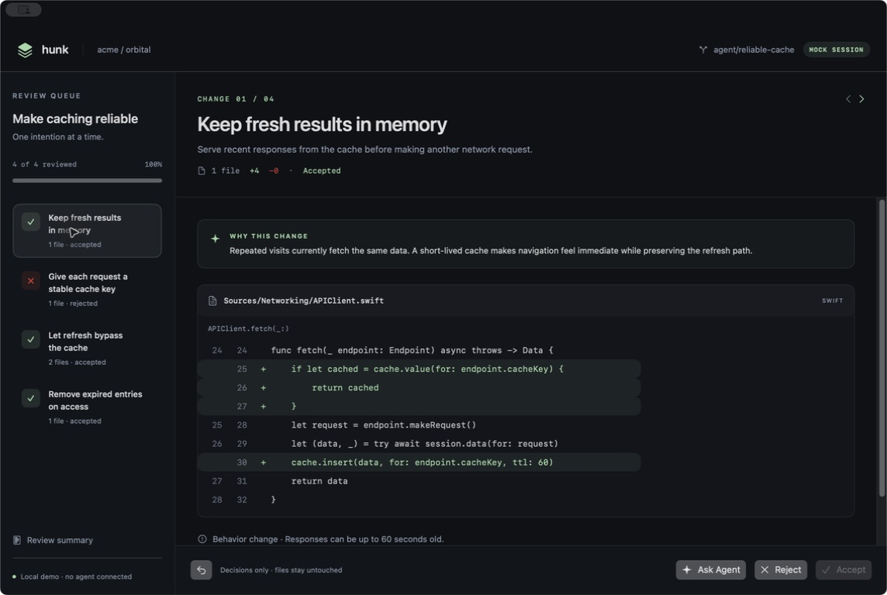

# Hunk

**Review AI-generated code, one meaningful change at a time.**

Hunk is a native macOS SwiftUI demo built around changes instead of files. Each change takes center stage with its intent, rationale, and relevant diffs. **Accept**, **Reject**, or **Ask Agent**, then move on. A single change can span multiple files.



## Getting started

Requires **macOS 14+** and **Swift 6+**. No external dependencies or API keys are needed.

Open `Package.swift` in Xcode 16 or later, select **Hunk / My Mac**, and run. Alternatively, run from the project directory:

```sh
swift run Hunk
```

To build a standalone app bundle:

```sh
bash scripts/build-app.sh
open dist/Hunk.app
```

The script builds for your Mac's architecture and applies an ad-hoc signature for local use. Developer ID signing and notarization for distribution are not included. This is a Swift Package that Xcode opens directly; no `.xcodeproj` is required.

## Reviewing changes

1. Explore four mock changes for a caching improvement.
2. Read the rationale, additions, deletions, and risk notes in the central review area. Scroll horizontally to inspect long lines.
3. Choose **Accept** or **Reject** to advance to the next pending change. Navigation wraps around to earlier pending changes when needed.
4. Open **Ask Agent** to ask a question or request a revision. Replies are simulated, and each change keeps its own conversation. Choose **Done** to return to the review.
5. Revisit changes from the queue or use **Undo** to reverse the last decision.
6. Open the summary and choose **Export review…** to save changes and decision history as JSON. The summary is available before the review is complete.

| Shortcut | Action |
| --- | --- |
| ⌘ Return | Accept a change, or send a request in the agent dialog |
| ⌘ Delete | Reject a change |
| ⌘ K | Open Ask Agent |
| ⌘ Z | Undo the last review decision |
| Escape | Close the agent dialog |

**Accept and Reject record review decisions only.** They do not apply or revert files, stage changes, create commits, or run tests. Sessions are held in memory and reset when the app exits. Export any results you want to keep. Starting a fresh demo clears the current decisions. Decisions and session resets are temporarily disabled while an agent request is in flight.

The sample code consists of illustrative excerpts, not a runnable cache library or validated patches. It intentionally leaves questions such as authentication scope and concurrency open for review. Changes 1 and 3 modify the same function sequentially and should not be treated as independently applicable patches.

## Architecture

```text
Sources/Hunk/
  HunkApp.swift          App entry point and window configuration
  Domain.swift          Semantic changes, file patches, diff lines, and protocols
  MockServices.swift    Mock change provider and delayed agent responses
  ReviewStore.swift     Selection, decisions, undo, conversations, and export
  ReviewView.swift      Queue, central diff, action bar, conversation, and summary
Tests/HunkTests/        XCTest coverage for review state
scripts/               App packaging and standalone smoke tests
```

The model is `SemanticChange → [FilePatch] → [DiffLine]`, keeping semantic grouping separate from file boundaries. The UI does not depend on Git or a particular agent's output format.

`ReviewStore` uses `@MainActor @Observable` and receives a `ChangeProvider` and an `AgentClient` through its initializer. Asynchronous replies are attached to the change that originated the request, even if selection changes before the reply arrives.

## Connecting Git diffs

Implement `ChangeProvider.loadSnapshot()` in a `GitChangeProvider` and inject it through `ReviewStore(provider:agent:)`. Git execution, diff parsing, and semantic grouping are extension points; they are not implemented in this demo.

Suggested integration steps:

1. Let the user select a repository and comparison scope: working tree, staged changes, or branch.
2. Invoke Git through Foundation `Process` with an executable URL and an argument array. Do not interpolate user input into shell commands. Read stdout and stderr asynchronously, and handle errors, cancellation, and timeouts.
3. Parse unified diffs into `FilePatch` and `DiffLine`. Define explicit handling for renames, binary files, deletions, whitespace, and untracked files. Surface unsupported output rather than silently dropping it.
4. Start with hunk-level groups, then introduce a grouping layer that combines related hunks into a `SemanticChange`. Track hunk identity to avoid duplicate assignments.
5. Store the base/head identity and a diff content hash in `ReviewSnapshot.revision`. The mock generates new UUIDs on each load; a real provider should derive stable IDs from the revision and hunk identity.
6. Implement patch application as a separate service. Before applying changes, revalidate the revision, check overlapping and dependent patches, verify applicability, and handle failures atomically. Do not turn a review decision directly into a file deletion or restoration.

## Connecting Codex or Claude Code

Implement `AgentClient.respond(to:)` in a dedicated adapter. `AgentRequest` includes the snapshot revision, the complete semantic change, and the user's message. `AgentReply` currently returns text only.

- Check the installed CLI version's supported structured output and session interface, then encapsulate those details inside the adapter. This project does not assume specific CLI flags or APIs.
- Manage the executable path, working directory, and authentication in a configuration layer. Handle stderr, exit codes, cancellation, and timeouts.
- For streaming, extend the response interface to `AsyncThrowingStream<AgentEvent, Error>`.
- If an agent edits code, load a new snapshot and invalidate or safely remap decisions from the old revision. Approval of an old diff must not silently apply to new code.
- Treat agent output and repository contents as untrusted data. Instructions embedded in source files must not grant permission to execute commands.

## Validation

```sh
swift build
bash scripts/smoke-test.sh
```

The standalone smoke tests work with Command Line Tools without a full Xcode installation. They cover decision navigation, undo, wraparound, reply isolation during an in-flight agent request, JSON export, session reset, multi-file grouping, and loading failures.

With a full Xcode installation and XCTest available, also run:

```sh
swift test
```

Some Command Line Tools installations report `no such module 'XCTest'`. Use the standalone smoke tests in that environment, or select a full Xcode installation as the active developer directory.

For manual UI verification, resize the window, navigate between changes, inspect a multi-file diff, send an agent request, accept and reject changes, undo a decision, and export the summary.

## Current scope

Hunk currently runs entirely on local mock data. Git operations, real agent execution, a test runner, session persistence and import, syntax highlighting, a code editor, and dependency-aware partial application remain future work. Review state and integration interfaces are separated so these capabilities can be added incrementally.
