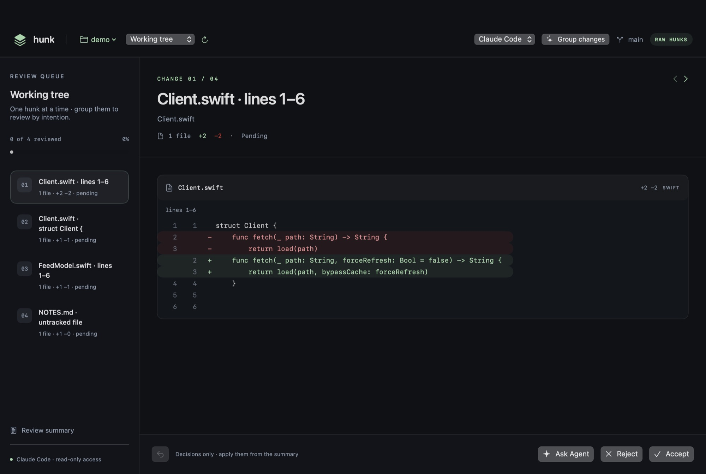

# Hunk

**Review AI-generated code, one meaningful change at a time.**

Hunk is a native macOS SwiftUI app built around changes instead of files. Point it at a Git repository, let **Claude Code** or **Codex** group the raw hunks into semantic changes, then **Accept**, **Reject**, or **Ask Agent** one intention at a time. A single change can span multiple files. When you're done, stage what you accepted.



## Getting started

Requires **macOS 14+**, **Swift 6+**, and Git. The agent features use whichever of the `claude` and `codex` CLIs you have installed and signed in; everything else works without them.

```sh
bash scripts/build-app.sh
scripts/hunk ~/path/to/repo      # or: open dist/Hunk.app, then ⌘O or drop a folder on the window
```

During development, `swift run Hunk --repo=/path/to/repo` works too, and `--demo` opens the built-in mock session. Hunk reopens the last repository on launch. Pass the path as `--repo=`; AppKit treats a bare path argument as a document and won't open a window.

The build script applies an ad-hoc signature for local use. Developer ID signing and notarization are not included.

## Reviewing a repository

1. Pick a scope in the header: **Working tree** (unstaged edits plus untracked files), **Staged**, or **Branch vs base** (merge-base with `origin/HEAD`, `main`, `master`, or `develop`).
2. Hunk starts with one change per hunk. Choose **Group changes** (⌘G) to have the selected agent merge related hunks into semantic changes with a title, rationale, risk, and suggested verification. Hunk validates the answer: every hunk ends up in exactly one change, and anything the agent forgot stays reviewable on its own.
3. **Accept** or **Reject** to advance to the next pending change. **Ask Agent** (⌘K) opens a per-change conversation; the agent can read the repository but not edit it.
4. Open the summary to **Stage accepted**, optionally **Discard rejected…**, or **Export review…** as JSON.

| Shortcut | Action |
| --- | --- |
| ⌘ O / ⌘ R | Open a repository / reload the diff |
| ⌘ G | Group hunks with the selected agent |
| ⌘ Return | Accept a change, or send a request in the agent dialog |
| ⌘ Delete | Reject a change |
| ⌘ ↑ / ⌘ ↓ | Previous / next change |
| ⌘ K | Open Ask Agent |
| ⌘ Z | Undo the last review decision |
| Escape | Close the agent dialog |

Decisions, grouping, and conversations are saved per repository and scope under `~/Library/Application Support/Hunk/sessions` and restored as long as the diff is byte-for-byte the same. If the diff changes, you get a fresh review; an approval of an old diff never carries over to new code.

## What applying does

**Accept and Reject only record decisions.** Nothing touches the repository until you apply from the summary, and only in the Working tree scope:

- **Stage accepted** runs `git apply --cached` with exactly the accepted hunks (`git add` for untracked, binary, and mode-only files). Your working files are unchanged; commit when you're ready.
- **Discard rejected…** asks for confirmation, then reverse-applies the rejected hunks to your files. A backup patch is written to `.git/hunk-backups/` first, and untracked files are moved to the Trash rather than deleted.
- Before applying, Hunk recomputes the diff fingerprint and refuses if anything changed since the review was loaded. Every patch is verified with `git apply --check` before the first write, so a hunk that no longer applies leaves everything untouched.

Hunk never commits, pushes, or runs tests.

## Agents

Both CLIs are driven non-interactively, with flags confined to `AgentCLI.swift`:

| | Claude Code | Codex |
| --- | --- | --- |
| Invocation | `claude -p --output-format json` | `codex exec --sandbox read-only --ephemeral` |
| Grouping | `--tools ""` and `--json-schema` | `--output-schema` |
| Ask Agent | `--tools Read,Grep,Glob` | read-only sandbox |

Prompts go through stdin, never a shell. Diff content is marked as untrusted data in every prompt, and neither agent is given a way to write to the repository. Hunk looks for the CLIs in the usual install locations (apps launched from Finder don't inherit your shell `PATH`); set `HUNK_CLAUDE_PATH` or `HUNK_CODEX_PATH` to override. Grouping sends your diff to the selected provider under your own account.

## Architecture

```text
Sources/Hunk/
  HunkApp.swift          App entry point, launch arguments, menu commands
  Domain.swift           Semantic changes, file patches, diff lines, and protocols
  ReviewStore.swift      Selection, decisions, undo, grouping, applying, persistence
  ReviewView.swift       Header, queue, central diff, action bar, conversation, summary
  ProcessRunner.swift    Async Process wrapper with timeouts and cancellation
  DiffParser.swift       Byte-exact unified diff parser
  GitServices.swift      Git change provider, scopes, and the decision applier
  AgentCLI.swift         Claude Code and Codex adapters for questions and grouping
  SessionArchive.swift   Per-repository session files
  MockServices.swift     Demo changes and a simulated agent
Tests/HunkTests/         XCTest coverage for review state
scripts/                 App packaging, launcher, smoke tests, live agent check
```

The model is `SemanticChange → [FilePatch] → [DiffLine]`, keeping semantic grouping separate from file boundaries. A `FilePatch` from Git carries its raw file header and hunk text, so applying never re-serializes a diff. Change identities are hashes of hunk content, which is what lets sessions survive a relaunch.

`ReviewStore` is `@MainActor @Observable` and talks only to protocols: `ChangeProvider`, `AgentClient`, `ChangeGrouper`, `DecisionApplier`, and `SessionArchive`. Asynchronous replies are attached to the change that originated the request, even if selection changes before the reply arrives.

## Validation

```sh
swift build
bash scripts/smoke-test.sh
```

The standalone smoke tests work with Command Line Tools without a full Xcode installation. They cover review state (navigation, undo, wraparound, in-flight agent isolation, export), diff parsing edge cases (CRLF, header-like content, missing trailing newline, binary files, quoted paths), and a real temporary Git repository: stable identities, session restore, grouping validation, staging and discarding with a backup, refusing a stale review, and scopes.

To check the agent adapters against the real CLIs (this uses your account):

```sh
bash scripts/agent-live-check.sh claude
bash scripts/agent-live-check.sh codex
```

`HUNK_SNAPSHOT=/tmp/hunk.png swift run Hunk --repo=/path/to/repo` saves the window as a PNG and quits, which is handy for visual checks without screen-recording permission.

With a full Xcode installation and XCTest available, also run:

```sh
swift test
```

Some Command Line Tools installations report `no such module 'XCTest'`. Use the standalone smoke tests in that environment, or select a full Xcode installation as the active developer directory.

For manual UI verification, resize the window, navigate between changes, inspect a multi-file diff, send an agent request, accept and reject changes, undo a decision, and export the summary.

## Current scope

Agents answer questions and group hunks; they don't edit code from inside Hunk yet, so a requested revision comes back as a proposed diff in the conversation. Replies are not streamed. Splitting a single hunk, syntax highlighting, committing, running tests, and unstaging from the Staged scope remain future work.
